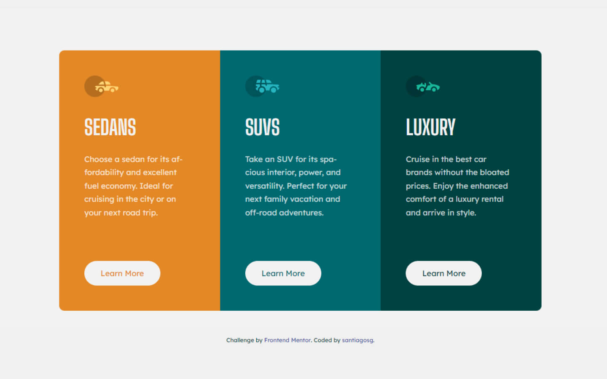
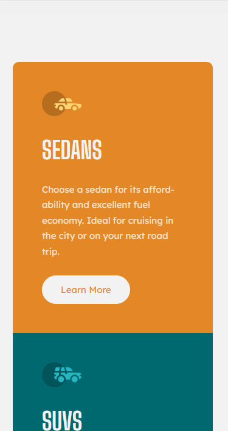

# Frontend Mentor - 3-column preview card component solution

This is a solution to the [3-column preview card component challenge on Frontend Mentor](https://www.frontendmentor.io/challenges/3column-preview-card-component-pH92eAR2-). Frontend Mentor challenges help you improve your coding skills by building realistic projects. 

## Table of contents

- [Overview](#overview)
  - [The challenge](#the-challenge)
  - [Screenshot](#screenshot)
  - [Links](#links)
- [My process](#my-process)
  - [Built with](#built-with)
- [Author](#author)

## Overview

### The challenge

Users should be able to:

- View the optimal layout depending on their device's screen size
- See hover states for interactive elements

### Screenshot

### Links

- Live Site URL: [live url](https://santiagosg.github.io/Frontend-mentor-solutions-newbie/3-column-preview-card-component/)
- Frontendmentor Solution: [frontendmentor URL](https://www.frontendmentor.io/solutions/3column-preview-card-component-with-sass-and-bem-3mu95dUuC)

## My process

### Built with

- Semantic HTML5 markup
- CSS custom properties
- CSS Grid
- Mobile-first workflow
- Sass preprocessor
- BEM naming convention

## Author

- Website - [santiagosg](https://santiagosg.github.io/)
- Frontend Mentor - [@santiagosg](https://www.frontendmentor.io/profile/santiagosg)
- Linkedin - [santiagosg21](https://www.linkedin.com/in/santiagosg21/)