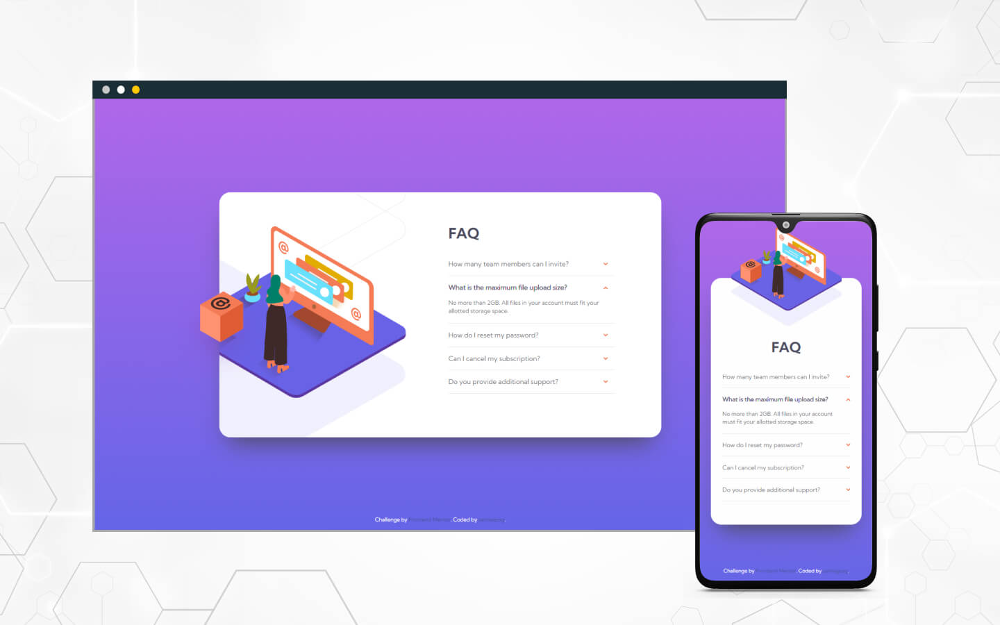

# Frontend Mentor - FAQ accordion card solution

This is a solution to the [FAQ accordion card challenge on Frontend Mentor](https://www.frontendmentor.io/challenges/faq-accordion-card-XlyjD0Oam). Frontend Mentor challenges help you improve your coding skills by building realistic projects. 

## Table of contents

- [Overview](#overview)
  - [The challenge](#the-challenge)
  - [Screenshot](#screenshot)
  - [Links](#links)
- [My process](#my-process)
  - [Built with](#built-with)
  - [Useful resources](#useful-resources)
- [Author](#author)

**Note: Delete this note and update the table of contents based on what sections you keep.**

## Overview

### The challenge

Users should be able to:

- View the optimal layout for the component depending on their device's screen size
- See hover states for all interactive elements on the page
- Hide/Show the answer to a question when the question is clicked

### Screenshot

### Links

- Live Site URL: [live url](https://santiagosg.github.io/Frontend-mentor-solutions-newbie/faq-accordion-card/)
- Frontendmentor Solution: [frontendmentor URL](https://www.frontendmentor.io/solutions/faq-accordion-card-using-sass-and-bem-EKK4wPyT-)

## My process

### Built with

- Semantic HTML5 markup
- CSS custom properties
- Flexbox
- CSS Grid
- Mobile-first workflow
- Sass preprocessor
- BEM naming convention

### Useful resources

- [Accordion layout](https://csslayout.io/accordion/) - This helped me an understanding of the structure of an accordion with html and css.
- [How TO - Collapsibles/Accordion](https://www.w3schools.com/howto/howto_js_accordion.asp) - This helped me understand accordion's interaction with JavaScript.
- [Imágenes adaptables](https://developer.mozilla.org/es/docs/Learn/HTML/Multimedia_and_embedding/Responsive_images#art_direction) - This helped me remember how responsive images work.

## Author

- Website - [santiagosg](https://santiagosg.github.io/)
- Frontend Mentor - [@santiagosg](https://www.frontendmentor.io/profile/santiagosg)
- Linkedin - [santiagosg21](https://www.linkedin.com/in/santiagosg21/)