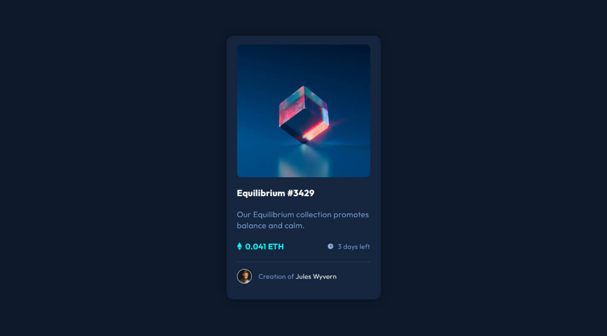
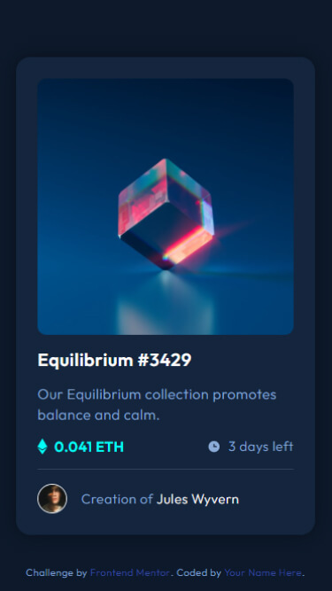

# Frontend Mentor - NFT preview card component solution

This is a solution to the [NFT preview card component challenge on Frontend Mentor](https://www.frontendmentor.io/challenges/nft-preview-card-component-SbdUL_w0U/hub/nft-preview-card-component-arL18RsLK). Frontend Mentor challenges help you improve your coding skills by building realistic projects.

## Table of contents

- [Overview](#overview)
  - [Screenshot](#screenshot)
  - [Links](#links)
- [My process](#my-process)
  - [Built with](#built-with)
- [Author](#author)

## Overview

### Screenshot

### Links

- Live Site URL: [live url](https://santiagosg.github.io/Frontend-mentor-solutions-newbie/nft-preview-card-component/)
- Frontendmentor Solution: [frontendmentor URL](https://www.frontendmentor.io/solutions/nft-preview-card-component-ELww-WGKR)

## My process

### Built with

- Semantic HTML5 markup
- CSS custom properties
- Grid
- Flexbox
- Sass preprocessor
- BEM naming convention

## Author

- Website - [santiagosg](https://santiagosg.github.io/)
- Frontend Mentor - [@santiagosg](https://www.frontendmentor.io/profile/santiagosg)
- Linkedin - [santiagosg21](https://www.linkedin.com/in/santiagosg21/)
