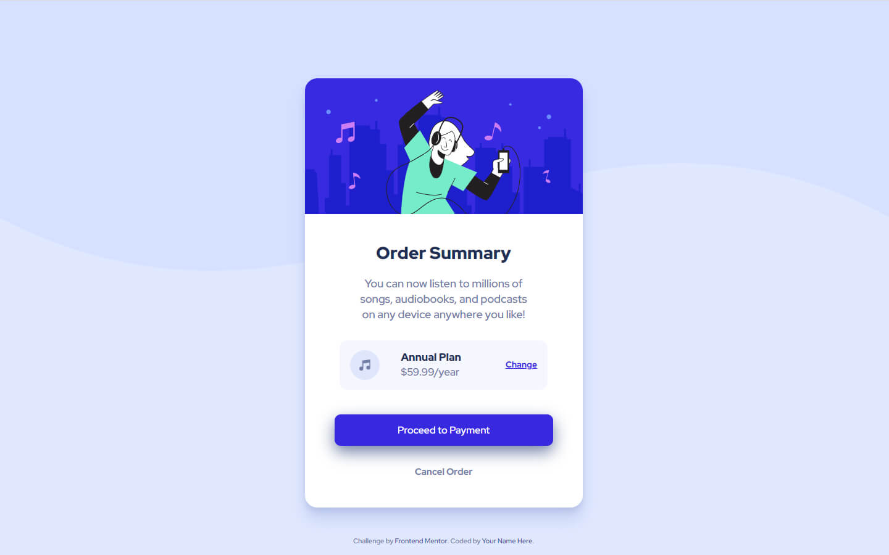

# Frontend Mentor - Order summary card solution

This is a solution to the [Order summary card challenge on Frontend Mentor](https://www.frontendmentor.io/challenges/order-summary-component-QlPmajDUj). Frontend Mentor challenges help you improve your coding skills by building realistic projects. 

## Table of contents

- [Overview](#overview)
  - [The challenge](#the-challenge)
  - [Screenshot](#screenshot)
  - [Links](#links)
- [My process](#my-process)
  - [Built with](#built-with)
  - [Useful resources](#useful-resources)
- [Author](#author)

**Note: Delete this note and update the table of contents based on what sections you keep.**

## Overview

### The challenge

Users should be able to:

- See hover states for interactive elements

### Screenshot

### Links

- Live Site URL: [live url](https://santiagosg.github.io/Frontend-mentor-solutions-newbie/order-summary-component/)
- Frontendmentor Solution: [frontendmentor URL](https://www.frontendmentor.io/solutions/order-summary-component-with-scssbem-LReC3Kzke)

## My process

### Built with

- Semantic HTML5 markup
- CSS custom properties
- Flexbox
- Mobile-first workflow
- Sass preprocessor
- BEM naming convention

### Useful resources

- [Flexbox guide](https://css-tricks.com/snippets/css/a-guide-to-flexbox/) - My first option to get a help to flex.

## Author

- Website - [santiagosg](https://santiagosg.github.io/)
- Frontend Mentor - [@santiagosg](https://www.frontendmentor.io/profile/santiagosg)
- Linkedin - [santiagosg21](https://www.linkedin.com/in/santiagosg21/)