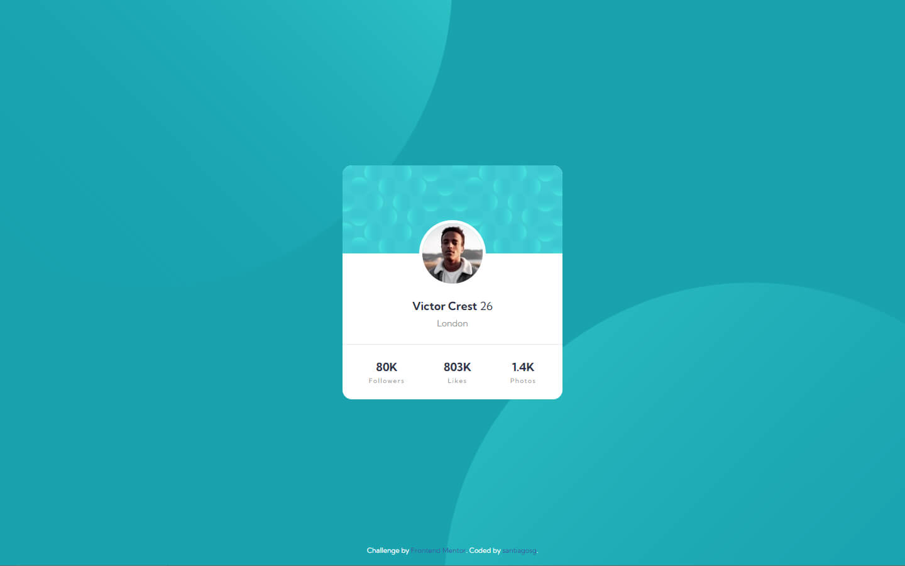

# Frontend Mentor - Profile card component solution

This is a solution to the [Profile card component challenge on Frontend Mentor](https://www.frontendmentor.io/challenges/profile-card-component-cfArpWshJ). Frontend Mentor challenges help you improve your coding skills by building realistic projects. 

## Table of contents

- [Overview](#overview)
  - [The challenge](#the-challenge)
  - [Screenshot](#screenshot)
  - [Links](#links)
- [My process](#my-process)
  - [Built with](#built-with)
  - [Useful resources](#useful-resources)
- [Author](#author)

**Note: Delete this note and update the table of contents based on what sections you keep.**

## Overview

### The challenge

- Build out the project to the designs provided

### Screenshot

### Links

- Live Site URL: [live url](https://santiagosg.github.io/Frontend-mentor-solutions-newbie/profile-card-component/)
- Frontendmentor Solution: [frontendmentor URL](https://www.frontendmentor.io/solutions/profile-card-component-IBDoRDFp9)

## My process

### Built with

- Semantic HTML5 markup
- CSS custom properties
- Flexbox
- Mobile-first workflow
- Sass preprocessor
- BEM naming convention

### Useful resources

- [background-position](https://css-tricks.com/almanac/properties/b/background-position/) - This helped me to position the 2 circles in background.

## Author

- Website - [santiagosg](https://santiagosg.github.io/)
- Frontend Mentor - [@santiagosg](https://www.frontendmentor.io/profile/santiagosg)
- Linkedin - [santiagosg21](https://www.linkedin.com/in/santiagosg21/)